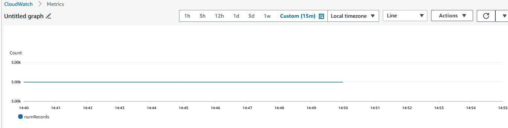

Custom Spark Listener As an EMR job to submit spark streaming metrics of a MSK Kafka topic to AWS CloudWatch

To run the job in EMR with a MSK Kafka topic, you should specify the following elements, and with the current versions when the Jar files are included:
--deploy mode client
--class com.amazonaws.awslabs.sparkstreaming.SparkListenerKafka
The various configurations
--jars
The S3 URI of the application: sparklistner-1.0-SNAPSHOT.jar
The application name such as: KAFKA06
The MSK client endpoint such as: b-1.cluster1.mshmv8.c2.kafka.us-east-2.amazonaws.com:9092,b-2.cluster1.mshmv8.c2.kafka.us-east-2.amazonaws.com:9092 
The topic name such as: FLIFO

Example of submiting the step in EMR cluster:
spark-submit --deploy-mode client --class com.amazonaws.awslabs.sparkstreaming.SparkListenerKafka --conf spark.yarn.am.waitTime=600000 --conf spark.driver.memory=5000m --conf spark.yarn.executor.memoryOverhead=1200 --conf spark.sql.autoBroadcastJoinThreshold=-1 --jars s3://shearts-logs-bucket/aws-java-sdk-1.11.977.jar,s3://shearts-logs-bucket/spark-sql-kafka-0-10_2.12-3.3.0.jar,s3://shearts-logs-bucket/kafka-clients-2.8.1.jar,s3://shearts-logs-bucket/spark-streaming-kafka-0-10_2.12-3.5.0.jar,s3://shearts-logs-bucket/spark-core_2.12-3.5.0.jar,s3://shearts-logs-bucket/spark-token-provider-kafka-0-10_2.12-3.3.0.jar,s3://shearts-logs-bucket/spark-tags_2.12-3.3.0.jar s3://shearts-logs-bucket/sparklistner-1.0-SNAPSHOT.jar KAFKA06 b-1.cluster1.mshmv8.c2.kafka.us-east-2.amazonaws.com:9092,PLAINTEXT://b-2.cluster1.mshmv8.c2.kafka.us-east-2.amazonaws.com:9092 FLIFO

The metrics the sample application captures:

Number of records:

